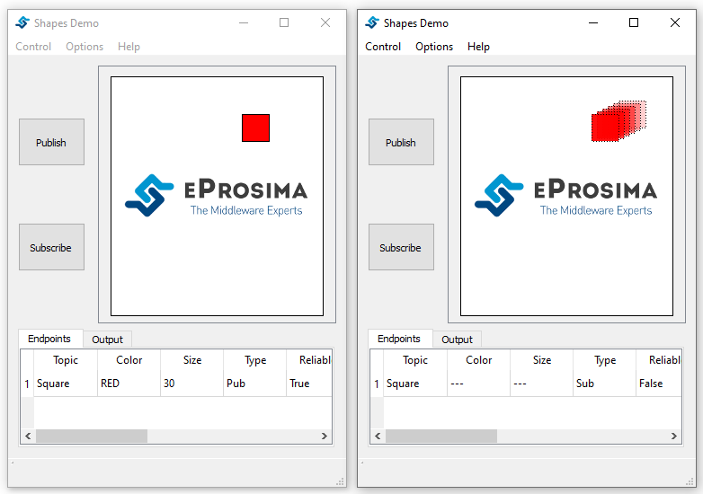
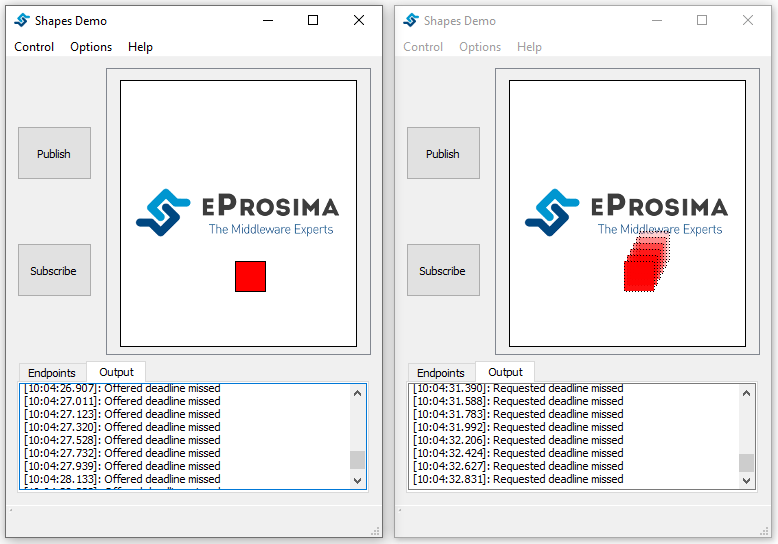

Deadline
==============================
The Deadline QoS raises an alarm when the frequency of new samples falls below a predefined threshold. This policy
can be useful for those cases which need periodical updates.

You can distinguish between the publisher and subscriber deadline period. On the publishing side, that period
defines the maximum interval between writes, while the subscriber one establishes the maximum interlude in which
the reader should receive a new sample.

In this test, we are going to create a publisher and a subscriber with a deadline period higher than the write rate
of the publisher to show the normal behavior of the system, and then we are going to increase that write rate
showing like that what happens when the deadline period expires.

**Step-by-Step**

First, launch two instances and create a publisher and a subscriber:

1 - Create a red square publisher:
   - Start eProsima Shapes-Demo. (We will refer to this instance as Instance1)
   - Click on Publish.
   - Select SQUARE option for Shape.
   - Select RED for Color.
   - Set Deadline Duration to 100. (The default write rate is 75 ms)

2 - Create a square subscriber:
   - Start eProsima Shapes-Demo. (We will refer to this instance as Instance2)
   - Click on Subscribe.
   - Select SQUARE option for Shape.
   - Set a value for the Deadline Duration higher or equal to the one stated for the publisher.
     (If the value of subscriber deadline duration is lower the entities don't match)

You can see now the normal behavior of the system, where the publisher is sending new samples and the subscriber
is receiving them before the deadline timer expires.

Now, let's increase the write rate:

3 - On Instance1:
    - Click on Options.
    - Select Preferences.
    - Set the update interval to 200.

.. image:: test9_3.png
   :scale: 100 %
   :alt: State 2
   :align: center

If you go to the *Output Tab*, you can observe that both of them are continuously missing the deadline,
as the value established for the deadline period is lower than the publishing rate.

