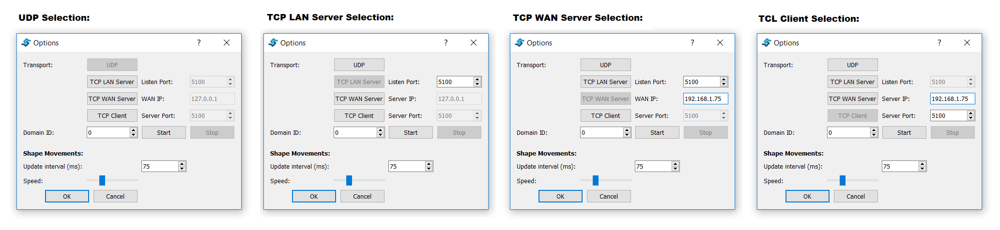

Using eProsima Shapes Demo
============================

This section guides you through the main menus of eProsima Shapes Demo. After the executable is launched you should see a window similar to the one presented in the following image.

.. image:: mainWindow.png
   :scale: 100 %
   :alt: Main Window
   :align: center

As you can see the main window is design for simplicity, with only two principal buttons situated on the left. There are additional menus that will be explained later.

Publishing a Shape
------------------

When the user presses the Publish button a new window appear to allow the user to define what type of Shape and which QoS the want to use in its publication. The following image shows an example of the Publication menu.

.. image:: publish.png
   :scale: 100 %
   :alt: Publish Window
   :align: center

There are multiple parameters that the user can define in this menu:

- **Shape:** This parameter defines the topic where the publication is going to occur. Three different shapes can be published: **Square**, **Circle** and **Triangle**.

- **Color:** The user can define the color of the Shape. This parameter will be used as key; that is, a way to distinguish between multiple instances of the same shape.

- **Size:** This parameter allows you to control how big the shape is. The size can vary between 1 and 99.

- **Partition:** The user can select different partitions to differentiate groups of publishers and subscribers. The user can select between four partitions (A, B, C and D). Additionally the user can select the “*” partition, that will be matched against all other partitions. The user should note, however, that using the *wildcard ()* partition is not the same as not using any partition. A publisher that uses the wildcard partition will not be matched with a subscriber that uses no partitions.

- **Reliable:** The user can select to disable the Reliable check-box to use a Best-Effort Publisher.

- **History and Durability:** The History of the Publishers is set to **KEEP_LAST**. The user can select the number of samples that the Publisher is going to save. The user can also select whether this History is going to be **VOLATILE** or **TRANSIENT_LOCAL**. The latter will send that last stored values to subscribers joining after the Publisher has been created.

- **Liveliness:** The user can select the Liveliness Qos for the Publisher between three different values: **AUTOMATIC**, **MANUAL_BY_PARTICIPANT** and **MANUAL_BY_TOPIC**. The user can also set the Lease Duration for the Publisher.

- **Ownership:** The Ownership Qos determines whether the instance (color) of the Topic (Shape) is owned by a single Publisher. If the selected ownership is **EXCLUSIVE** the Publisher will use the Ownership strength value as the strength of its publication. Only the publisher with the highest strength can publish in the same Topic with the same Key.

- **Deadline:** The Deadline Qos determines the maximum expected amount of time between samples.

- **Lifespan:** The Lifespan Qos determines the duration while the sample is still valid.

- **Disable Positive ACKs:** If enabled, doesn't expects for positive ACKs from the subscriber, considering delivered sent samples after the indicated duration if no negative ACKNACK was received.

Take into acoount that Disabling positive ACKs and modify Lifespan will not have any visual effect.

Subscribing to a Shape
----------------------

When the user presses the Subscriber button a new window appear to allow the user to define what type of Shape and which QoS the want to use in its subscription. The following image shows an example of the Subscribe menu.

.. image:: subscribe.png
   :scale: 100 %
   :alt: Subscribe Window
   :align: center

This menu is very similar to the Publication menu but the user cannot change the color and size, and it has additional elements:

- **Time Based Filter:** This value can be used by the user to only specify the minimum amount of time (in milliseconds) that the subscriber wants between updates.

- **Content Based Filter:** This filter draws a rectangle in the shapes window. Only the instances that are included in this rectangle are accepted. The rest of them are ignored. The user can dynamically resize and move this content filter.

Take into acoount that Disabling positive ACKs and modify Lifespan will not have any visual effect.

Other Options
-------------

The eProsima Shapes Demo application allows the user to define additional options. To see the Options window, please click *Options->Preferences* in the main bar. The following image shows the Options Menu.

The user can customize several aspects of ShapesDemo operation:

- **Transport Protocol:** UDP is the default transport protocol for Fast RTPS but TCP protocol is available. In order to use TCP we must be aware of its point-to-point connection nature: one of the ShapesDemo instance must be a TCP server and all the others must be TCP clients. To use TCP follow the next steps:

    + Push the *Stop* button in order to end UDP use. This will automatically remove all publishers and subscribers from this instance.

    + To create a TCP LAN server push the corresponding button and fill the *Server Port* textbox with an available port where the application will be listening for incoming connections.

    + To create a TCP WAN server push the corresponding button:

        - fill the *WAN IP* textbox with the public IPv4 router address.
        - fill the *Server Port* textbox with an available TCP port where the application will be listening for incoming connections.

        Note that the router NAT and computer firewall settings must allow external connections to the server port.

    + To create a TCP client push the corresponding button:

        - fill the *Server IP* textbox with the IP address of the server.
        - if client and server do not share the same net because the server is behind a NAT the WAN IP address of the server gateway must be specified.
        - fill the *Server port* textbox with the corresponding server listening port.

    + Push the *Start* button in order to resume ShapesDemo operation.

- **Domain ID:** The user can select different Domain Ids. Shapes Demo instances using different Domain Ids will not communicate. To modify the Domain ID the user needs to stop the participant (thus removing all existing Publishers and Subscribers) and start a new one with the new Domain Id.

- **Update interval:** This value changes the publication period for all the Publishers.

- **Speed:** This scrollbar allows the user to change how much the Shape moves between two write calls.

Endpoints and Output tabs
-------------------------

A table including all created endpoints is also provided. An example of this legend is shown in the following image.

.. image:: table1.png
   :scale: 100 %
   :alt: Endpoints
   :align: center

The user can use this table to remove endpoints. Two methods are provided:

- Right click in an endpoint: An option to remove the endpoint is shown.
- Pressing the delete button when the endpoint is selected.

An example of the output tab is shown in the next figure.

.. image:: table2.png
   :scale: 100 %
   :alt: Outputs
   :align: center
