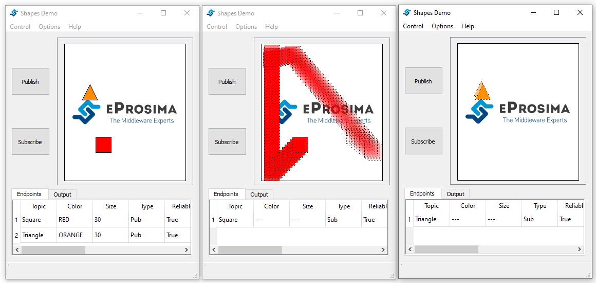

Lifespan
==============================
The Lifespan QoS establishes the maximum validity period of the samples saved on an entity's history. When
the lifespan period elapses, the corresponding sample is automatically removed.

Unlike other QoS, such as `Deadline <deadline.html>`__ or `Liveliness <liveliness.html>`__, this test does not provide a means to inform the user that
the sample is being removed, which makes this test more complicated to illustrate. For this reason, we are
going to create two publishers and two subscribers, and make only one of them use Lifespan, so that the effect
of using this QoS can be graphically seen.

**Step-by-Step**

First, launch an instance and create the two publishers:

1 - Create a red square publisher:
   - Start eProsima Shapes-Demo. (We will refer to this instance as Instance1)
   - Click on Publish.
   - Select SQUARE option for Shape and RED for Color.
   - Select TRANSIENT_LOCAL option for the Durability.
   - Make sure that RELIABLE checkbox is marked.
   - Set History to 100.
   - Leave the Lifespan Duration to infinite.

2 - Create an orange triangle publisher on the previous ShapesDemo instance:
   - Click on Publish.
   - Select TRIANGLE option for Shape and ORANGE for Color.
   - Select TRANSIENT_LOCAL option for the Durability.
   - Make sure that RELIABLE checkbox is marked.
   - Set History to 100.
   - Set Lifespan Duration to 50.

After that, change the write rate to 1000:

3 - On Instance1:
    - Click on Options.
    - Select Preferences.
    - Set the update interval to 1000.

.. image:: test10_1.png
   :scale: 100 %
   :alt: Initial state
   :align: center

Now, create two subscribers:

4 - Create a square subscriber:
   - Start eProsima Shapes-Demo. (We will refer to this instance as Instance2)
   - Click on Subscribe.
   - Select SQUARE option for Shape.
   - Select TRANSIENT_LOCAL option for the Durability.
   - Make sure that RELIABLE checkbox is marked.
   - Set History to 100.
   - Leave the Lifespan Duration to infinite.

5 - Create a triangle subscriber:
    - Start eProsima Shapes-Demo. (We will refer to this instance as Instance3)
    - Click on Subscribe.
    - Select TRIANGLE option for Shape.
    - Select TRANSIENT_LOCAL option for the Durability.
    - Make sure that RELIABLE checkbox is marked.
    - Set History to 100.
    - Set Lifespan Duration to 50.

Note that when a new subscriber matches with the publisher, due to the TRANSIENT_LOCAL durability, all the
samples stored on the publisher history are sent automatically to the new subscriber.

Now let's explain what is happening on Instance2 and Instance3. As you can see, the square subscriber history is
filled rapidly, while the triangle subscriber one is filled at the same speed as the orange triangle publisher
sends new samples. This is because in the second case, samples in the orange triangle publisher history were removed
by the Qos, and are no longer available to be sent to the subscriber, while the red square publisher history samples were
kept in the history.

