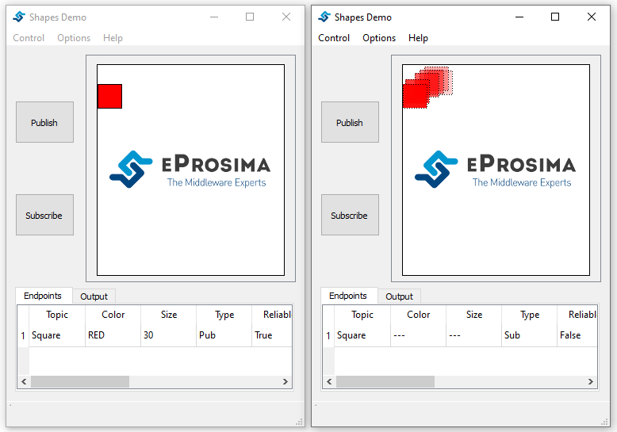
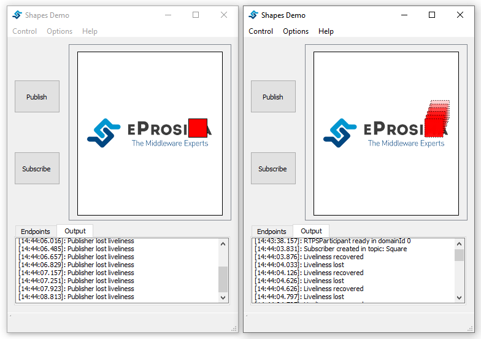

Liveliness
==============================
The Liveliness QoS can be used to ensure whether particular entities are alive or not.

You can select AUTOMATIC, MANUAL_BY_PARTICIPANT or MANUAL_BY_TOPIC liveliness. If you select AUTOMATIC or 
MANUAL_BY_PARTICIPANT either for publisher or subscriber, you can establish a value for the lease duration and 
announcement period or remain them as infinite. But if the kind selected is MANUAL_BY_TOPIC, you can only establish 
a value for the lease duration as the announcement period is not used for this configuration.

In the AUTOMATIC liveliness kind, the service takes the responsibility for renewing the timer associated to the lease 
duration as long as the DomainParticipant keeps running and remote participants remain connected, considering all the 
entities within the DomainParticipant alive.

The remaining kinds (MANUAL_BY_PARTICIPANT and MANUAL_BY_TOPIC) need periodically an assertion to consider the remote 
participants as alive.

In this test, we are going to create a Publisher and Subscriber using AUTOMATIC liveliness and a lease duration value
higher than the write rate of the publisher.

**Step-by-Step**

First, you have to launch two instances and create a Publisher and a Subscriber:

1 - Create a red square publisher:
   - Start eProsima Shapes-Demo. (We will refer to this instance as Instance1)
   - Click on Publish.
   - Select SQUARE option for Shape and RED for Color.
   - Select AUTOMATIC.
   - Set Lease Duration to 150. (The default write rate is 75 ms)

2 - Create a square subscriber:
   - Start eProsima Shapes-Demo. (We will refer to this instance as Instance2)
   - Click on Subscribe.
   - Select SQUARE option for Shape.
   - Select AUTOMATIC.
   - Set a value for the Lease Duration higher or equal to the one stated for the Publisher. 
     (If the value of subscriber lease duration is lower the entities don't match)

If you go to the *Output Tab* on Instance2, you can observe that the subscriber has recovered the liveliness once it
matches with the publisher.

Now, you have to open the Task Manager and kill the process corresponding with the publisher (Instnace1). As you can
see, the subscriber lost the liveliness as the publisher doesn't terminate cleanly.

