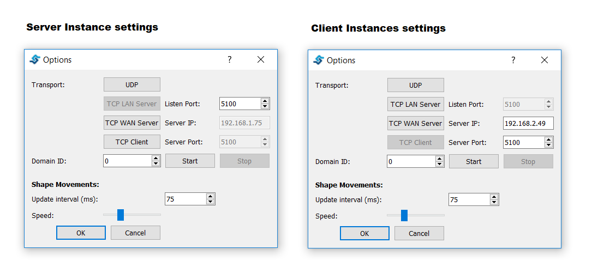
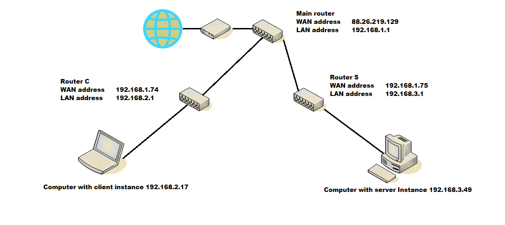
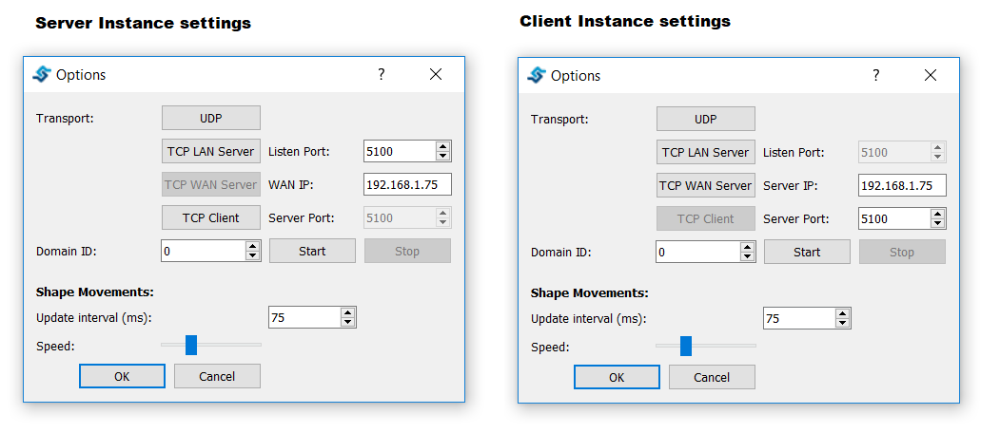

TCP Transport
==============

Fast RTPS transport layer could be adapted to specific network requirements. UDP transport is optimal for localhost applications but in order to interact within a LAN or WAN a TCP transport may be required. Here we explain how Shapes Demo should be set up in order to fit some network specific layouts.

LAN configuration
-----------------

This is a common scenario where several computers share the same LAN network. In this case one of the computers should set up Shapes Demo as a server and all the others as clients. Let's suppose that the server computer LAN IP address is 192.168.2.49 then all clients instances of Shapes Demo in the other computers must specify this IP Server address. In this case we select as TCP port 5100 but any other available TCP port is valid. The server computer firewall must allow inbound traffic on the selected port.

  
   
WAN configuration
-----------------

In this scenario the server computer does not share network with its clients but its reachable through a WAN IP address. This may happen if the server and clients are in a different LANs of the same WAN like WWW. In order to test this scenario we used the following network layout:

In the above diagram we can see:

	* a client LAN network managed by router C. In this network a client Shapes Demo instance runs in computer address 192.168.2.17.
	* a server LAN network managed by router S. In this network the server Shapes Demo instance runs in computer address 192.168.3.49. Router S NAT settings relay any inbound traffic to TCP port 5100 towards Sever computer. TCP port 5100 was arbitrarily chosen, any available port will do. The Server computer firewall settings allow inbound traffic to TCP port 5100. 
	* a Main router which simulates the WAN network. In this network router C has address 192.168.1.74 and router S has address 192.168.1.75.
	
The previous configuration (see `LAN configuration`_) does not work in this network scenario because server and client are behind a NAT.

The above image shows server and client settings:
   
	* The client *server IP* is no longer the server IP address (192.168.3.49) because is meaningless in client context. The server's router IP address must be used (router S 192.168.1.75) because the client's router can understand this address and properly lead the outbound traffic.
	* The server *WAN IP* is the server's router IP address (router S 192.168.1.75). Router S NAT settings relay inbound traffic to server's TCP port towards Server computer.