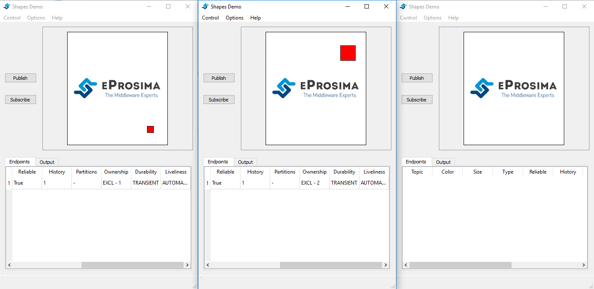

Ownership
=========

The Ownership Qos determines if the Topic (Shape) is owned by a single Publisher. 
If the selected ownership is EXCLUSIVE the Publisher will use the Ownership strength value as the strength of its publication. 
Only the Publisher with the highest strength can publish in the same Topic.

Create publishers
-----------------

We create two Publishers with the following characteristics.

+--------+--------+-------+---------+---------+----------+------------+-------------+
|        | Shape  | Color | Partion | History (Reliable) | Durability | Ownership   |
+========+========+=======+=========+====================+============+=============+
| **V1** | Square | RED   | NO      |       1 (ON)       | VOLATILE   | EXCLUSIVE 1 |
+--------+--------+-------+---------+--------------------+------------+-------------+
| **V2** | Square | RED   | NO      |       1 (ON)       | VOLATILE   | EXCULISVE 2 | 
+--------+--------+-------+---------+--------------------+------------+-------------+

The size of the square is 15 in V1, in contrast, in V2 the size of the square is 35. In the following image we can appreciate the difference.

Create subscriber
-----------------
   
Now, we create a Subscriber in V3.

+--------+--------+---------+--------------------+------------+-----------+
|        | Shape  | Partion | History (Reliable) | Durability | Ownership |
+========+========+=========+====================+============+===========+
| **V3** | Square | No      | 1 (ON)             | VOLATILE   | EXCLUSIVE |
+--------+--------+---------+--------------------+------------+-----------+

Only the Publisher in V2 can publish, due to this, we have a big square in the shapes window of V3. 

.. image:: test5_3.png
   :scale: 100 %
   :alt: State 1
   :align: center

Delete V2
---------
   
If we stop V2, V1 will can publish into the square topic. In the following image we can appreciate this behaviour. V3 has an small square in the shapes window.

.. image:: test5_4.png
   :scale: 100 %
   :alt: State 2
   :align: center
