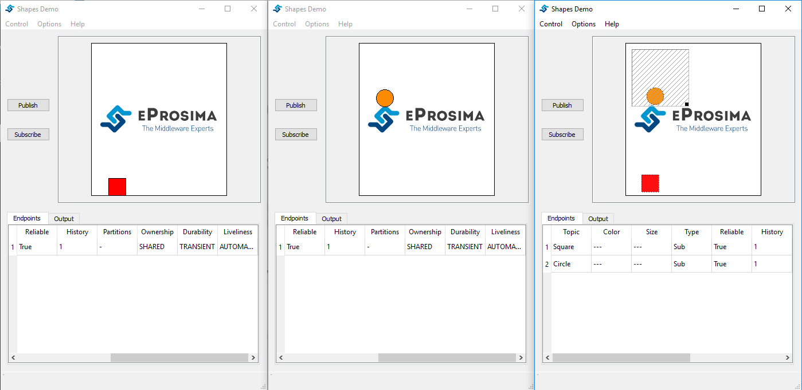
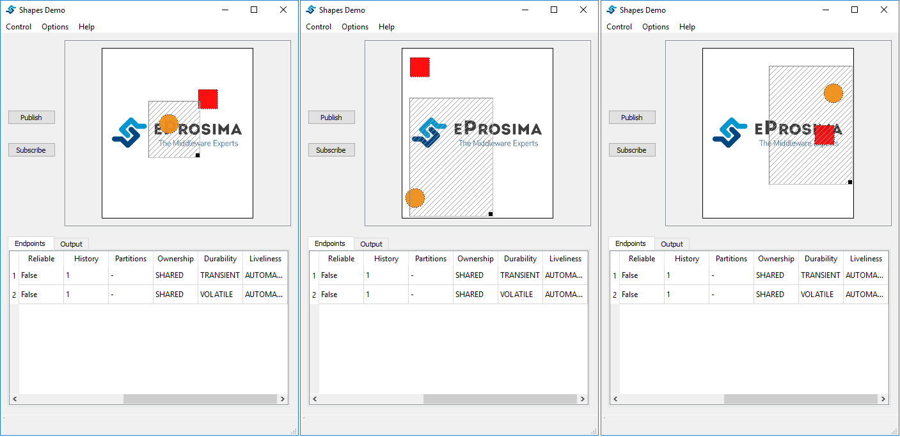

Content Base Filter
===================

This filter draws a rectangle in the shapes window. Only the instances that are inside the rectangle are accepted. The rest of them are ignored. You can resize and move this content filter dynamically.

Create Publishers
-----------------

We launch two Publishers in vendor V1 y V2 with the following characteristics (We can create both in the same vendor)

+--------+----------+--------+-----------+---------+----------+------------+-----------+
|        | Shape    | Color  | Partition | History (Reliable) | Durability | Ownership |
+========+==========+========+===========+====================+============+===========+
| **V1** | Square   | RED    | NO        |     1 (ON)         | VOLATILE   | SHARED    |
+--------+----------+--------+-----------+--------------------+------------+-----------+
| **V2** | Circle   | ORANGE | NO        |     1 (ON)         | VOLATILE   | SHARED    | 
+--------+----------+--------+-----------+--------------------+------------+-----------+

.. image:: test6_2.png
   :scale: 100 %
   :alt: Initial state
   :align: center

Create Subscribers
------------------
   
Now, we create two Subscribers in vendor V3:

+--------+--------+---------+--------------------+------------+--------------+
|        | Shape  | Partion | History (Reliable) | Durability | Content base |
+========+========+=========+====================+============+==============+
| **V3** | Square | No      | 1 (ON)             | VOLATILE   | NO           |
+--------+--------+---------+--------------------+------------+--------------+
| **V3** | Circle | No      | 1 (ON)             | VOLATILE   | OK           |
+--------+--------+---------+--------------------+------------+--------------+

Conclusions
-----------

If the circle is out of the rectangle, it is ignored.

.. image:: test6_3.png
   :scale: 100 %
   :alt: State 1
   :align: center

On the contrary, if the instance is in the rectangle, it is accepted.

   
The rectangle is configurable, you can resize and move it dynamically. The following images show examples of the filter.

   
